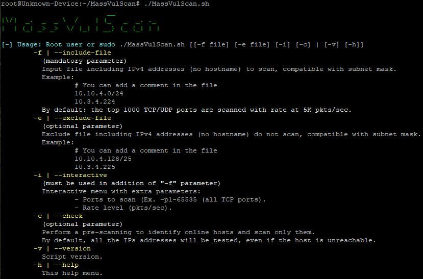
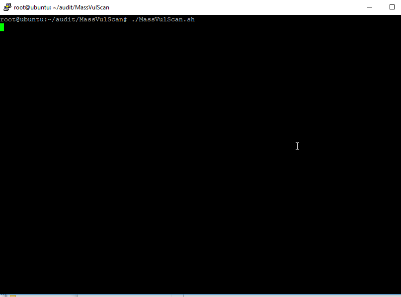
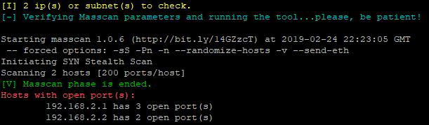
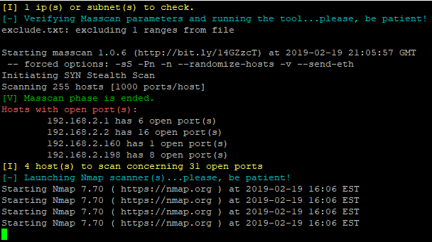
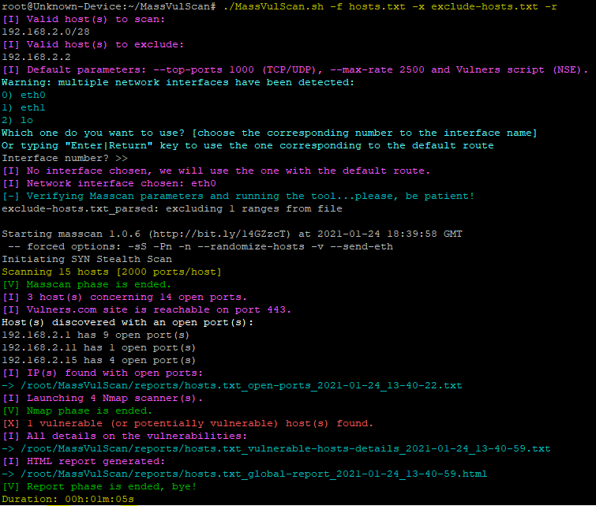
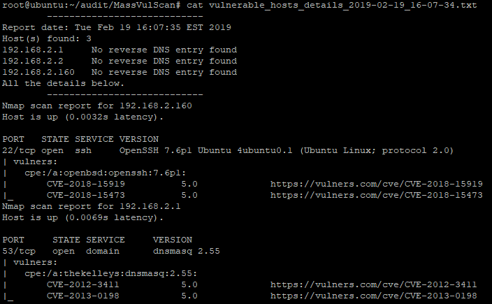
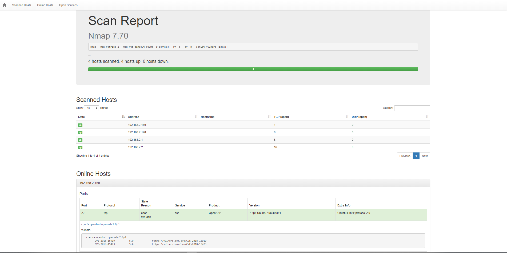

# MassVulScan :alien: [Version Francaise](https://github.com/choupit0/MassVulScan/blob/master/README-FR.md)
[](https://github.com/choupit0/MassVulScan/releases/tag/v1.9.2)
[](https://github.com/choupit0/MassVulScan/blob/master/LICENSE)
[](https://github.com/choupit0/MassVulScan/graphs/commit-activity)
[](https://www.gnu.org/software/bash/)
# Description
Bash script which combines the power of the Masscan scanner to find open ports, the efficiency of the Nmap scanner to identify open services and their version, and finally the NSE vulners.nse script to identify potential vulnerabilities (CVEs). An HTML report will be generated containing the result of the analysis as well as a TXT file allowing to focus on the vulnerable hosts.



# Prerequisites
- Package xsltproc (for the conversion of an XML file to HTML, for the final report)
- Package ipcalc (for IPs addresses validation)
- Masscan, version >= 1.0.5 (https://github.com/robertdavidgraham/masscan)
- Nmap (https://nmap.org)
- NSE script vulners.nse (https://github.com/vulnersCom/nmap-vulners)

**I invite you to read the file "requirements.txt" if you have difficulties. It will tell you how to install each of the prerequisites.**

**Otherwise, the script will install all necessary prerequisites for you at runtime. Or, you just need to call the install script like this the first time:**
```
(root or sudo) sources/installation.sh --auto-installation-latest (latest packages of Nmap and Masscan ~5 minutes)
```
**Or:**
```
(root or sudo) sources/installation.sh --auto-installation-apt (speedest but without the last versions ~1 minute)
```
**Note about APT installation**
Warning, I detected an error with the APT version. There is a mistake of upstream. The Masscan version 1.0.5 tag points to
a commit that still contains 1.0.4 as version. But this is the correct code for the 1.0.5 version. https://github.com/robertdavidgraham/masscan/issues/566#issuecomment-798877419
(Thank you to https://github.com/rhertzog)

**Only Debian OS family is currently compatible.**
This feature has been validated on the following 64bit OS (2 core CPU and 2GB RAM ~5 minutes with latest packages):
- Debian 10.0
- Elementary 5.0
- LinuxMint 19.1
- Ubuntu 19.04
- Parrot 5.5.17 (HackTheBox / HTB compatible)
- Kali 2023 (HackTheBox / HTB compatible)
# How the script works?
The main steps of the script:
1) Express identification of hosts that are online with nmap (optional)
2) For each host, extremely fast identification of open TCP/UDP ports (masscan)
3) The result is sorted to gather all ports and protocols to be scanned BY host (could be saved, optional)
4) Identification of services and vulnerabilities with multiple sessions in parallel (nmap + vulners.nse), one session per host
5) Generated reports: HTML report containing all the details on each host, vulnerable or not, and TXT file allowing to focus on hosts (potentially) vulnerable

The HTML report uses a bootstrap style sheet (https://github.com/honze-net/nmap-bootstrap-xsl) for more convenience.
# How to use it?
All you have to do is indicate the file (-f | --include-file) containing a list of networks, IPs and/or hostnames to scan:
```
git clone https://github.com/choupit0/MassVulScan.git
cd MassVulScan
chmod +x MassVulScan.sh
(root user or sudo) ./MassVulScan.sh -f [input file]
```
List of available parameters/arguments:

**Mandatory parameter:**
```
-f | --include-file = File including IPv4 addresses (CIDR format) or hostnames to scan (one by line)
```
**Optional parameters:**
```
-x | --exclude-file = File including IPv4 addresses ONLY (CIDR format) to NOT scan (one by line)
-i | --interactive = Extra parameters: ports to scan, rate level and NSE script
-a | --all-ports = Scan all 65535 ports (TCP + UDP) at 2K pkts/sec with NSE vulners script
-c | --check = Perform a pre-scanning to identify online hosts and scan only them
-r | --report = File including IPs scanned with open ports and protocols
-n | --no-nmap-scan = Use only the script to detect the hosts with open ports (no HTML report)
```
By default the script will scan only the first 1000 TCP/UDP ports among the most common ports. You can find the list here: /usr/local/share/nmap/nmap-services. Similarly, the rate or number of packets per second is set to 2500 by default.

For the format of the files, you will find two examples in the dedicated directory:
```
root@ubuntu:~/audit/MassVulScan# cat example/hosts.txt
# Private subnet
192.168.2.0/24
webmail.acme.corp
root@ubuntu:~/audit/MassVulScan# cat example/exclude.txt
# Gateway
192.168.2.254
```
**Note that the script will detect if you have multiple network interfaces. This is important for Masscan, which will always used the interface that has the default route. You will be asked to choose one (no problem with Nmap).**

# GIF Demo

# Some screenshots









# Tree structure
```
root@Unknown-Device:~/MassVulScan# tree
.
├── CHANGELOG.md
├── demo
│   └── MassVulScan_Demo.gif
├── example
│   ├── exclude-hosts.txt
│   ├── hosts.txt
│   ├── hosts.txt_global-report_2021-01-24_13-51-40.html
│   ├── hosts.txt_open-ports_2021-01-24_13-50-51.txt
│   └── hosts.txt_vulnerable-hosts-details_2021-01-24_13-51-40.txt
├── LICENSE
├── MassVulScan.sh
├── README-FR.md
├── README.md
├── reports
├── requirements.txt
├── screenshots
│   ├── Ex-vulnerable-host-found.PNG
│   ├── Full-script.PNG
│   ├── HTML.PNG
│   ├── Masscan.PNG
│   ├── Menu_1-9-1.PNG
│   └── Nmap.PNG
├── sources
│   ├── installation.sh
│   ├── top-ports-tcp-1000.txt
│   └── top-ports-udp-1000.txt
└── stylesheet
    └── nmap-bootstrap.xsl

6 directories, 22 files
```
# Compatibility
The script has only been tested on Debian family OS but should work on most Linux distributions (except for the automatic prerequisites installation). It can detect open ports on TCP and UDP protocols.
# Notes / Tips
Note that the advantage of using the NSE vulners.nse script is that it systematically polls the vulners.com site database, so it will be the latest available data. Similarly, the latter performs a ranking and sorting of identified CVEs, the most severe at the top of the list, which is very convenient.

The script is also compatible with Nmap's categories (https://nmap.org/book/nse-usage.html#nse-categories) to search for specific vulnerabilities (the better known as ms17-010, EternalBlue) in addition to the CVEs identified from vulners.com.

Finally, with the "interactive mode" (-i) you have the possibility to type scripts args also, e.g. vulners --script-args mincvss=5
# Known issues
Concerning SNMP, sometimes UDP port scan doesn't seems correctly working with masscan program. I'm trying to find a solution.
# TODO
Improve the pre-scanning phase to identify online hosts (fping).

Manage better multiple IP addresses on one network interface.

Improve process of installation (install what is strictly necessary, comparison of versions).

Improve the parsing of hosts file to detect duplicate networks, Ex: 10.10.18.0/24 and 10.10.18.0/28, and avoid duplicate scan.
# Changelog
[Changelog](https://github.com/choupit0/MassVulScan/blob/master/CHANGELOG.md)
