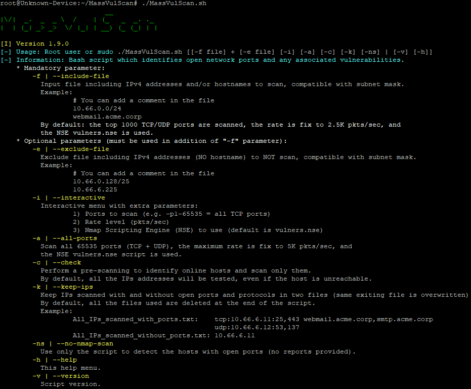
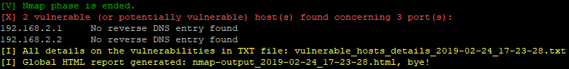

# MassVulScan :alien: [Version Francaise](https://github.com/choupit0/MassVulScan/blob/master/README-FR.md)
[](https://shields.io/)
[](https://github.com/choupit0/MassVulScan/blob/master/LICENSE)
[](https://github.com/choupit0/MassVulScan/graphs/commit-activity)
[](https://www.gnu.org/software/bash/)
# Description
Bash script which combines the power of the Masscan scanner to find open ports, the efficiency of the Nmap scanner to identify open services and their version, and finally the NSE vulners.nse script to identify potential vulnerabilities (CVEs). An HTML report will be generated containing the result of the analysis as well as a TXT file allowing to focus on the vulnerable hosts.



# Prerequisites
- Package xsltproc (for the conversion of an XML file to HTML, for the final report)
- Masscan, version >= 1.0.5 (https://github.com/robertdavidgraham/masscan)
- Nmap (https://nmap.org)
- NSE script vulners.nse (https://github.com/vulnersCom/nmap-vulners)

**I invite you to read the file "requirements.txt" if you have difficulties. It will tell you how to install each of the prerequisites.**

A new feature in version v1.7 of the script will install for you all the prerequisites necessary for the script. Only Debian OS family is currently compatible.
This feature has been validated on the following 64bit OS (2 core CPU and 2GB RAM ~10 minutes):
- Debian 10.0
- Elementary 5.0
- LinuxMint 19.1
- Ubuntu 19.04
- Parrot 5.5.17 (HackTheBox / HTB)
# How the script works?
The main steps of the script:
1) Express identification of hosts that are online (nmap)
2) For each of these hosts, extremely fast identification of open TCP/UDP ports (masscan)
3) The result (file) is sorted to gather all ports to be scanned by host
4) Identification of services and vulnerabilities, multiple sessions (nmap + vulners.nse) in parallel, one session per host
5) Display of (potentially) vulnerable hosts on the screen at the end of the script
6) Generation of two reports: a global HTML report will be created containing all the details for each of the hosts, vulnerable or not and a TXT file allowing to focus on hosts (potentially) vulnerable with the details

The HTML report uses a bootstrap style sheet (https://github.com/honze-net/nmap-bootstrap-xsl) for more convenience.
# How to use it?
All you have to do is indicate the file (-f | --include-file) containing a list of networks, IP or hostnames (version 1.9.0) to scan:
```
git clone https://github.com/choupit0/MassVulScan.git
cd MassVulScan
chmod +x MassVulScan.sh
(root user or sudo) ./MassVulScan.sh -f [input file]
```
List of available parameters/arguments:
```
-f (input file) = mandatory parameter that will contain the list of networks, IP or hostnames to scan
-e (exclude file) = optional parameter to exclude a list of networks or IP (no hostnames) to scan
-i (interactive mode) = optional parameter to choose ports to scan, speed (pkts/sec for Masscan) and Nmap script
-a (all ports) = optional parameter to scan all 65535 ports (TCP and UDP), at rate to 2K pkts/sec
-c (check) = optional parameter which perform a pre-scanning to identify online hosts and scan only them
-k (keep files) = optional parameter to keep all the IPs scanned in 2 files (with and without ports)
-ns (no Nmap scan) = optional parameter to detect the hosts with open ports only
```
By default the script will scan only the first 1000 TCP/UDP ports among the most common ports. You can find the list here: /usr/local/share/nmap/nmap-services. Similarly, the rate or number of packets per second is set to 2500 by default.

For the format of the files, you will find two examples in the dedicated directory:
```
root@ubuntu:~/audit/MassVulScan# cat example/hosts.txt
# Private subnet
192.168.2.0/24
webmail.acme.corp
root@ubuntu:~/audit/MassVulScan# cat example/exclude.txt
# Gateway
192.168.2.254
```
**Note that the script will detect along the way if you are using multiple network interfaces. This is important for Masscan, which will always default to the interface that has the default route. You will be asked to choose one (no problem with Nmap).**
# GIF Demo

# Some screenshots





# Compatibility
The script has only been tested on Debian family OS but should work on most Linux distributions (except for prerequisites installation). It can detect open ports on TCP and UDP protocols.
# Notes / Tips
Note that the advantage of using the NSE vulners.nse script is that it systematically polls the vulners.com site database, so it will be the latest available data. Similarly, the latter performs a ranking and sorting of identified CVEs, the most severe at the top of the list, which is very convenient.

The script is also compatible with Nmap's categories (https://nmap.org/book/nse-usage.html#nse-categories) to search for more vulnerabilities (the better known as ms17-010, EternalBlue) in addition to the CVEs identified from vulners.com.

Finally, with the "interactive mode" (-i) you have the possibility to type scripts args also, e.g. vulners --script-args mincvss=5
# Known issues
Concerning SNMP, sometimes UDP port scan doesn't seems correctly working with masscan program. I'm trying to find a solution.
# TODO
Manage better multiple IP addresses on one network interface.

Improve process of installation (install what is strictly necessary, comparison of versions).

Include netcat packages.
