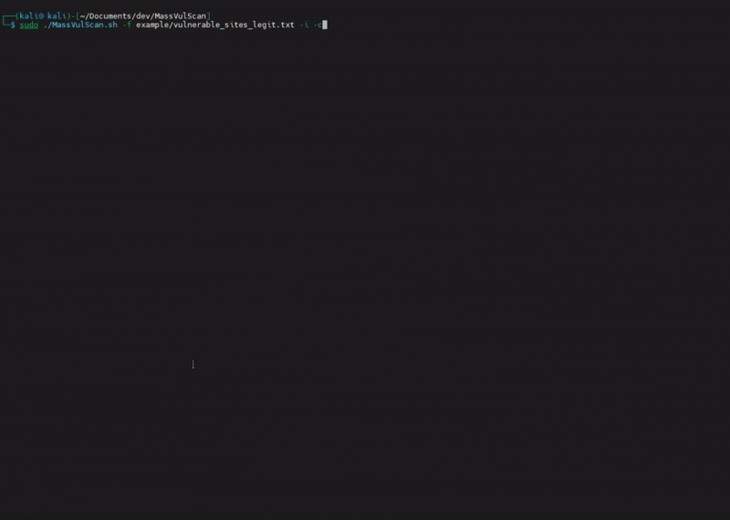
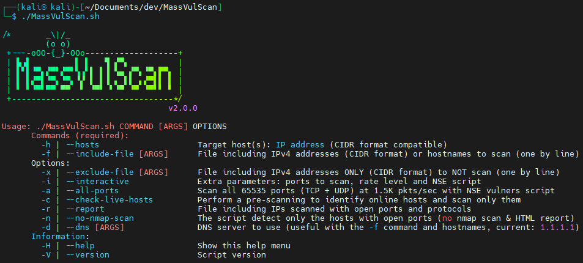

<p align="center">
  
</p>

<p align="center">🔍 <b>A fast network scanning tool to detect open ports and security vulnerabilities</b></p>

<p align="center">
  <a href="https://github.com/choupit0/MassVulScan/tags"></a>
  <a href="https://github.com/choupit0/MassVulScan/issues"></a>
  <a href="https://github.com/choupit0/MassVulScan/graphs/commit-activity"></a>
  <a href="https://www.gnu.org/software/bash/"></a>
  <a href="https://github.com/choupit0/MassVulScan/blob/master/LICENSE"></a>
  <a href="https://github.com/choupit0/MassVulScan"></a>
</p>

## 🌟 Overview
**MassVulScan** is a high-performance network scanning tool for pentesters (HackTheBox / HTB / Kali compatible) and system/network administrators looking to identify open ports and potential vulnerabilities on their internal/external networks. Built on powerful tools like `masscan` and `nmap`, it combines speed and accuracy to scan large-scale networks efficiently.

## 🎯 Features
- **Fast Port Scanning**: Built on `masscan` for quick open-port detection.
- **Vulnerability Detection**: Uses `nmap` scripts for detailed service analysis.
- **Optimized Scans**: Intelligent subnet filtering to avoid duplicates.
- **Modern and Interactive**: Enhanced aesthetics and interactivity with Gum.
- **Optimized Installation**: Only installing missing packages.
- **Platform Compatibility**: Runs on Linux, Debian OS family only.
- **Power of Bash**: Simplicity meets performance

## 📋 Changelog
[Changelog](https://github.com/choupit0/MassVulScan/blob/master/CHANGELOG.md)

### Last update
2.1.0 (2025-08-15)

**Améliorations ou changements/Implemented enhancements or changes:**

- Adding a new option "-I | --interface" to choose the network interface to use for scanning (e.g. eth0, wlan0)

2.0.1 (2025-04-11)

**Correction de bugs/Fixed bugs:**

- Nmap 7.95 compilation issue resolved (e.g., Debian 12, Issue #4)
- Code review and cleanup
- Path issue resolved for certain generated reports (-h command with a host containing special characters)
- Missing packages and revision of their installation order

## 📦 Installation
Refer to the `requirements.txt` file for the exact list of necessary packages. 

```bash
# Clone the repository
git clone https://github.com/choupit0/MassVulScan.git

# Go to the project directory
cd MassVulScan
```
On first launch of `MassVulScan.sh`, **the script can automatically install only the missing prerequisites**. It will list any missing or outdated packages (such as `masscan` and `nmap`) and offer to install them for you. Once installed, **this check won’t be repeated, saving time and improving efficiency**:

```
# Run the main script (root or sudo)
./MassVulScan.sh
```
You also have the option to run the installation script directly `installation.sh` without going through the main script. It will offer to **install ALL prerequisites for you without exception and without checking whether they are already present or not**:

```bash
# Install ALL the dependencies (root or sudo) ~5 minutes
./sources/installation.sh
```
### Additional parameters
| Parameter            | Description                                                   |
|----------------------|---------------------------------------------------------------|
| `-auto-installation` | Install ALL prerequisites **without asking for confirmation** |

```bash
./sources/installation.sh -auto-installation
```

## 🛠️ How MassVulScan Works

**MassVulScan** follows a streamlined process to identify active hosts, open ports, and potential vulnerabilities across your network:

| **Step** | **Description**                                                                                                                                                            |
|----------|----------------------------------------------------------------------------------------------------------------------------------------------------------------------------|
| **1**    | **Quick Host Discovery**: Uses `nmap` to efficiently identify online hosts.                                                                                                |
| **2**    | **Rapid Port Scanning**: Performs an ultra-fast scan with `masscan` to detect open TCP/UDP ports per host.                                                                 |
| **3**    | **Data Organization**: Compiles and sorts detected ports and protocols by host. Data can be saved for later analysis.                                                      |
| **4**    | **Service and Vulnerability Detection**: Runs multiple parallel sessions (`nmap` + `vulners.nse` by default) to detect services and vulnerabilities, one session per host. |
| **5.1**  | **HTML Report**: Contains detailed information on each host, including vulnerabilities, with a clean and accessible layout.                                                |
| **5.2**  | **TXT Report**: Focuses on potentially vulnerable hosts for quick reference (if vulnerabilities are discovered).                                                           |

The HTML report uses a Bootstrap stylesheet ([nmap-bootstrap-xsl](https://github.com/honze-net/nmap-bootstrap-xsl)) for enhanced readability and a user-friendly format.

## 🚀 Usage (root or sudo)
### File-based scanning mode:

`targets.txt` containing a list of networks, IPs and/or hostnames to scan.

```bash
./MassVulScan.sh -f targets.txt
```

`exclude.txt` containing including IPv4 addresses (CIDR format compatible) to NOT scan (Ex. ISP routers, gateways, etc...).

```bash
./MassVulScan.sh -f targets.txt -x exclude.txt
```

### Command-line argument mode:

```bash
./MassVulScan.sh -h 172.18.0.0/24 -I eth1
```

```
./MassVulScan.sh -h 172.18.0.10-172.18.0.100
```

```
./MassVulScan.sh -h 172.18.50,172.18.32.16
```

### Interactive mode (to be combined with the `-h` and `-f` commands):

```bash
./MassVulScan.sh -h 192.168.1.0/24 -i -c
```

## 🎬 Interactive mode demo


### Full option list:

```bash
./MassVulScan.sh -H
```

### ⚙️ Required commands
| Commands | Description                                                                         |
|----------|-------------------------------------------------------------------------------------|
| `-h`     | Target host(s), IPs compatible with CIDR format, a comma-separated list, or a range |
| `-f`     | File with IPs and/or hostnames to scan, one by line (CIDR format compatible)        |

### ⚙️ Additional options
| Option | Description                                                                                              |
|--------|----------------------------------------------------------------------------------------------------------|
| `-x`   | Exclude these IPs (CIDR format compatible), one by line (e.g. gateways from your providers)              |
| `-i`   | Interactive mode: ports to scan, rate level and NSE script to use (e.g. vulners --script-args mincvss=5) |
| `-a`   | Scan all ports (TCP + UDP) at 1.5K pkts/sec with NSE vulners script                                      |
| `-c`   | Perform a pre-scanning to identify online hosts and scan only them                                       |
| `-r`   | Generate a TXT file including IPs scanned with open ports and protocols                                  |
| `-n`   | Quick mode without full Nmap scan to detect the hosts with open ports (no HTML report)                   |
| `-d`   | DNS server to use (useful with the -f command and hostnames, current: 1.1.1.1)                           |
| `-I`   | Network interface to use for scanning (e.g. eth0, wlan0), or the one with the default route is used      |
| `-H`   | Show help                                                                                                |
| `-V`   | Show MassVulScan version                                                                                 |

By default the script will scan only the first 1000 TCP/UDP ports among the most common ports. You can find the list here: /usr/local/share/nmap/nmap-services. Similarly, the rate or number of packets per second is set to 1500 by default.

**Note that the script will detect if you have multiple network interfaces. This is important for Masscan, which will always used the interface that has the default route. You will be asked to choose one (no problem with Nmap) if no interface is chosen (-I).**

The script is also compatible with Nmap's categories (https://nmap.org/book/nse-usage.html#nse-categories) to search for specific vulnerabilities (the better known as ms17-010, EternalBlue) in addition to the CVEs identified from vulners.com.

##  📸 Some screenshots



## 🐞 Known issues
No known issues.
## ✅ TODO
Make the script full compatible with IPv6 (work in progress).

Identify why Nmap is slower when run via the script compared to directly from the CLI.

Manage better multiple IP addresses on one network interface.

~~#5 Interface via the command~~ Option added in version 2.1.0

~~Improve process of installation (install what is strictly necessary, comparison of versions).~~

~~Improve the interactive part for parameter selections.~~

~~Allow scanning a host without using an input file (command-line argument).~~

~~Improve the parsing of hosts file to detect duplicate networks, Ex: 10.10.18.0/24 and 10.10.18.0/28, and avoid duplicate scan.~~

## Star History

<a href="https://star-history.com/#choupit0/massvulscan&Date">
 <picture>
   <source media="(prefers-color-scheme: dark)" srcset="https://api.star-history.com/svg?repos=choupit0/massvulscan&type=Date&theme=dark" />
   <source media="(prefers-color-scheme: light)" srcset="https://api.star-history.com/svg?repos=choupit0/massvulscan&type=Date" />
   
 </picture>
</a>
